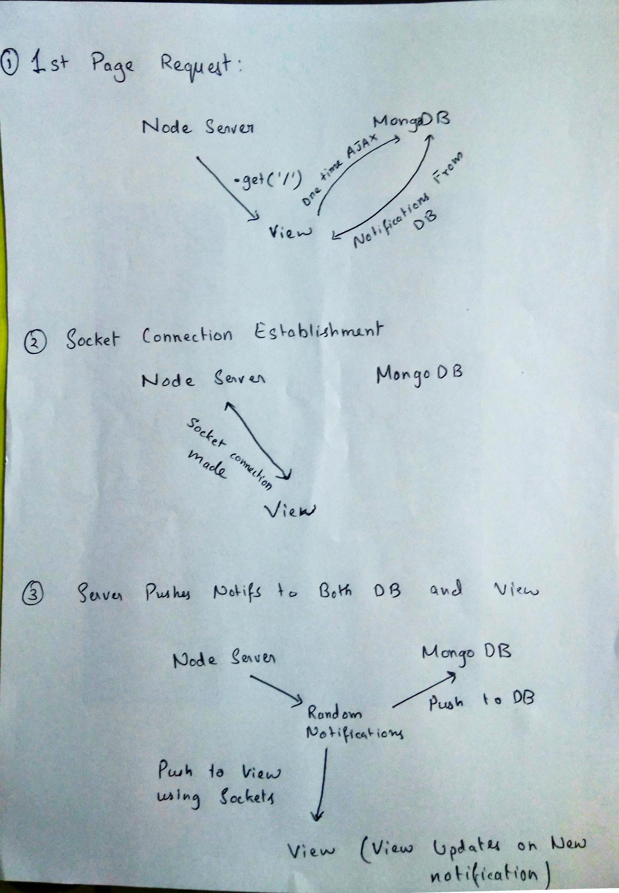

# Notificaton Dropdown:

Notification dropdown example, that loads notifications from server at random intervals.<br>
On first page load, Notifications are loaded from the Database, subsequent Notifications are loaded using sockets. Server pushes notifications to Database and to the client using sockets.

Explanation:

1. Page loads and it fetches for notifications from Database. Notifications are then rendered on page.
1. Socket connection between Node Server and Client is established. Subsequent notifications are then sent to client using sockets.
1. Node server generates new Notifications, pushes it to both Database and Client.
1. On Page refresh, again all notifications from Database is loaded first then the process repeats.
1. Clicking on Bell icon or Closing the Dropdown Marks all notifications as read.
1. Clicking on 'Delete all notifications' truncates the Database and reloads the page.

Why WebSockets ? Faster and smaller in size than http + suitable for these type of instant data transfer.

## My attempt at explaining this through some diagrams



### About the code

Extensive use of JavaScript ES6\. Short and Nice.<br>
Strictly followed JavaScript style guide by [airbnb](https://github.com/airbnb/javascript), enforced the style guide using ESlint configs from [elsint-config-airbnb](https://www.npmjs.com/package/eslint-config-airbnb).

Can do the same using other tech stacks, but this is the way I preffered for it to be **efficient, production ready and scalable**.

View Layer: ReactJs
- Could have also done the same with Vanilla JS, But React is faster, And I preffer it for dynamic, repeated component views.


Server: Nodejs
- Can do with Python Django, but just tried to keep all code in JavaScript


Database: MongoDB
- Mlab.com offers 500Mb free MongoDB instance, used this so that you won't need to set up one.


### Tech Stack

- JavaScript ES6
- ReactJs
- Nodejs
- MongoDb
- websockets

### Pre-requisites

- Node >6.0
- npm or yarn

### Try it

I have hosted a MongoDb database Instance at mlab.com and configured it for the project, so that you don't have to fiddle with setting up one.

```sh
# Go to project root
# Install all dependencies
$ npm install
# or
$ yarn install

# build project
$ npm run build

# Start server
$ npm run server
```

Open <http://localhost:3001/><br>
Done!
